

## Creative Coding 2: Custom Pixel

The images above are photos of Wellington CBD algorithmically processed with a lightly modified version of the [p5.js Pointillism example](https://p5js.org/examples/image-pointillism.html). The masks for each photo highlight various objects. Replace this text with your own which explains the source of your photos, masking, and applied algorithm.

talk about how ai worked or didn't work

include all images you've processed

credit the tutorials that i've used 

give title 

# Predator's Eye by Eri Lovegrove
## MDDN 242 2024 Assignment 3

### Description
Predator's Eye is a lens that identifies native birds in images using AI and applies a filter. The concept of the filter is an abstract idea of how a native bird might look to the dangers they are subject to, either to predators or climate change. I wanted to convey this idea by making the general image express danger or discomfort, and have the focus be on the native birds. I did this by tinting the image red and inversing the colours, increasing the saturation and creating a pixel effect made of small crosses on the birds as well as overlaying a target on top. 

### Process
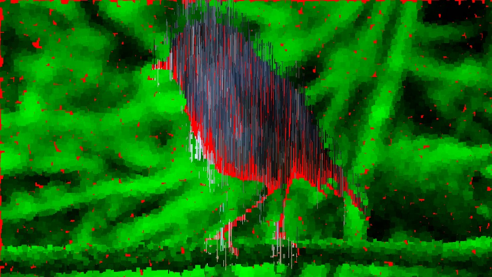\
1. my first bit of code was copied form Phoebe's example code

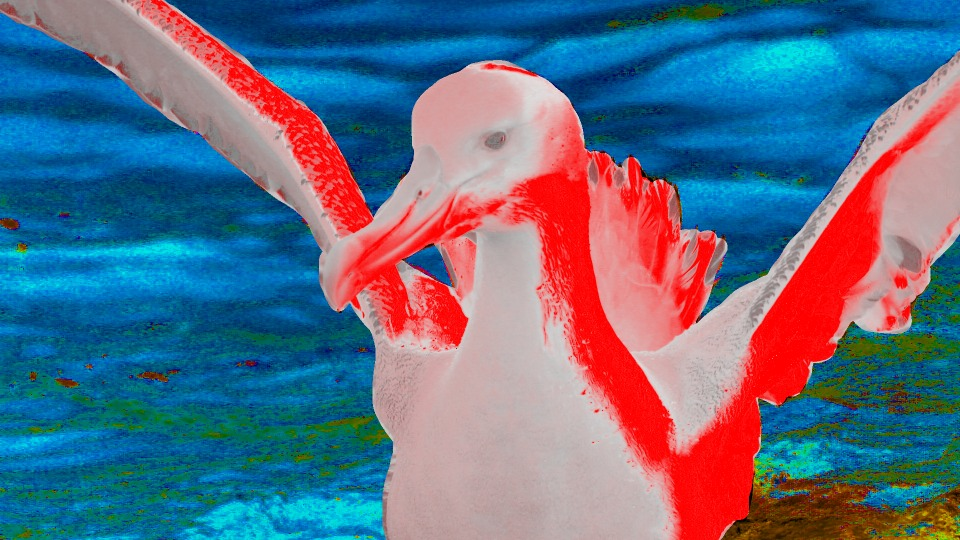\
2.Here I started experimenting with HSB values

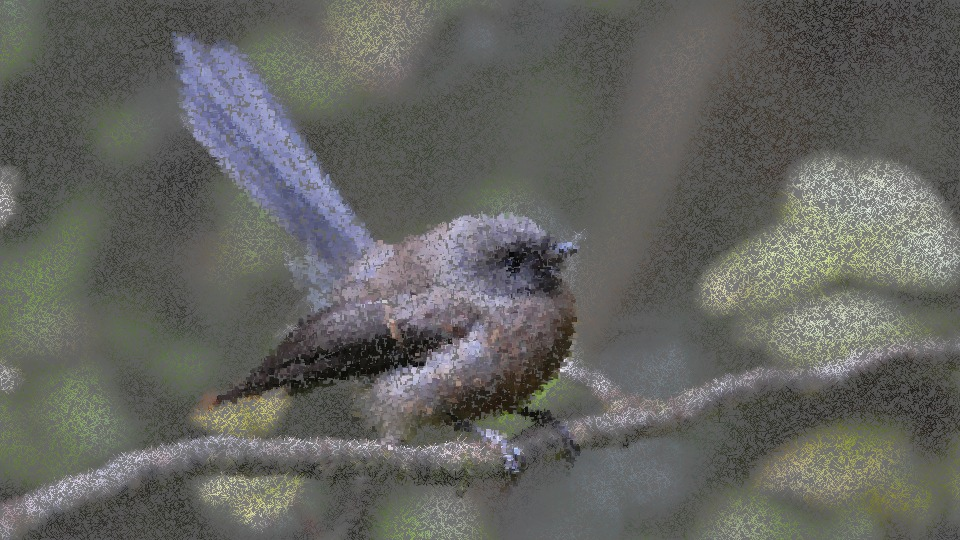\
 3. My initial code for creating 2 layers that I copied from the example code

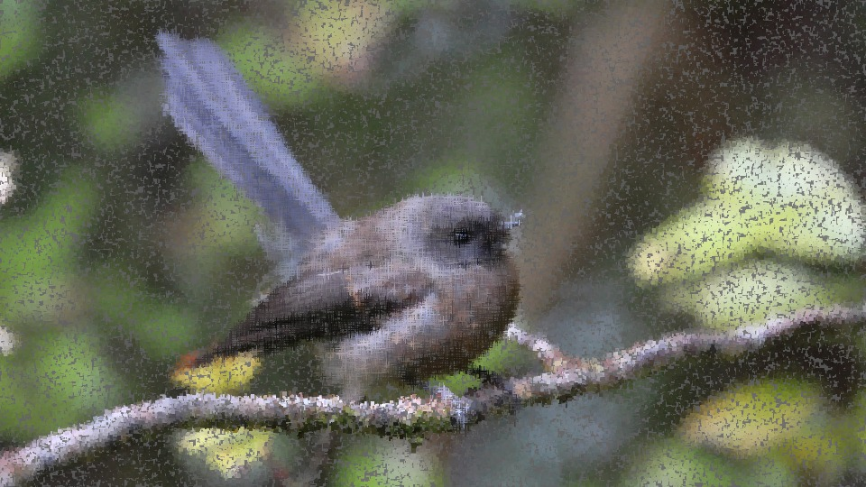
 4. I created my own shape, a cross so that a cross hatching effect will be applied

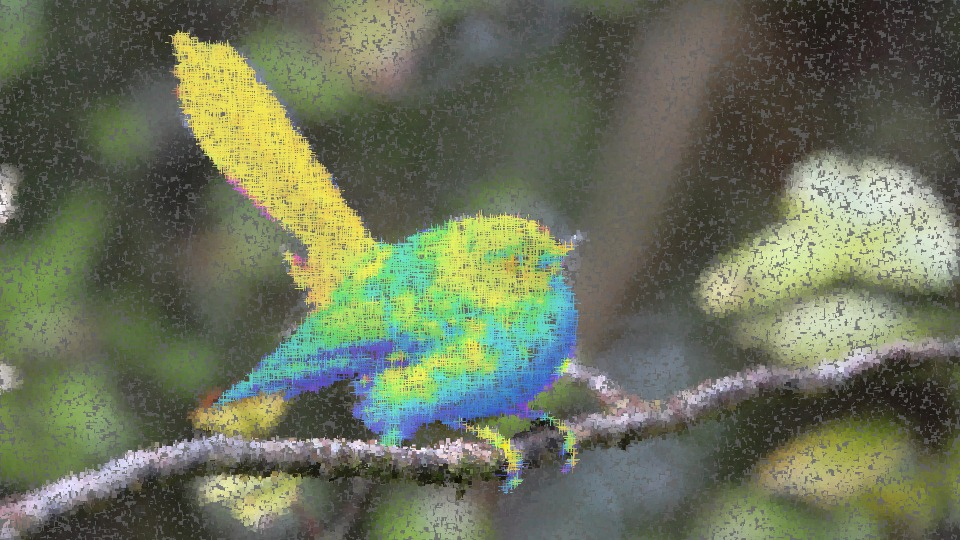
 5. Here I inversed the colours and upped the saturation of the bird.

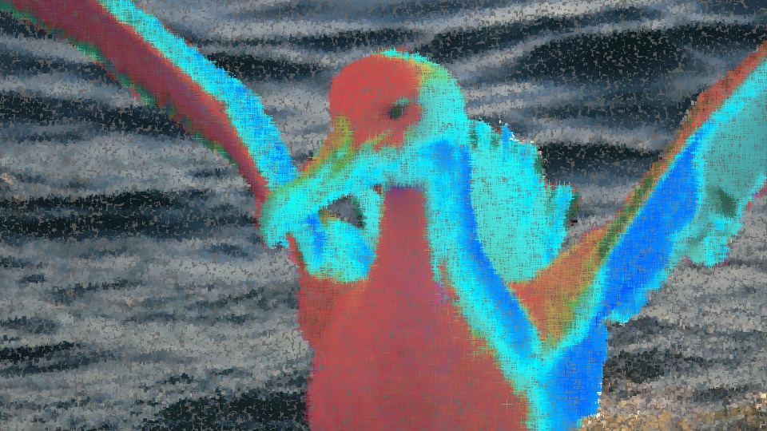
 6. Same thing with a different image

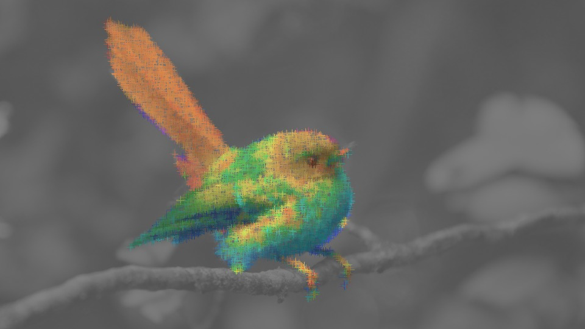
 7. I wanted the background to not be pixelated so the contast between the background and bird would be clearer

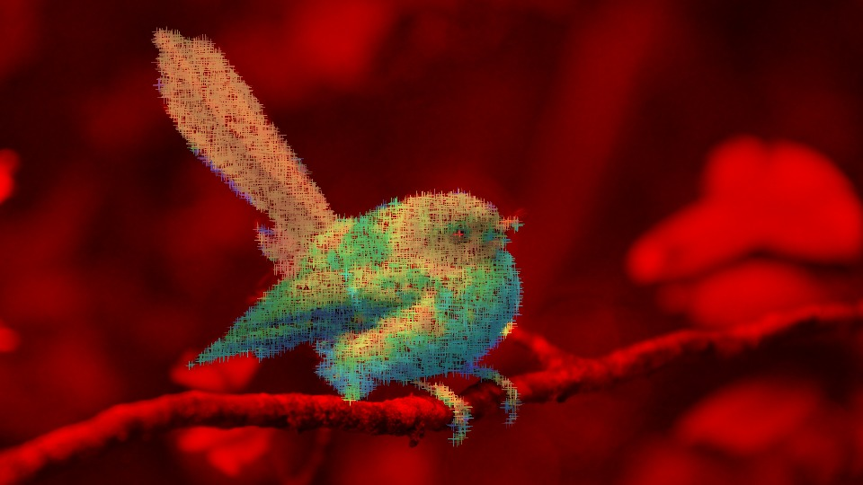
 8. I decided to tint the background red to express a more dangerous vibe.

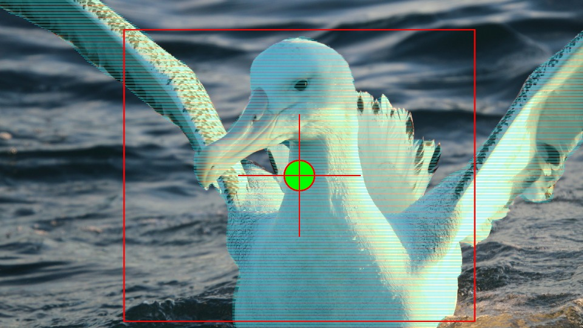
 9. Here I copied another piece of example code to apply an image over the mask

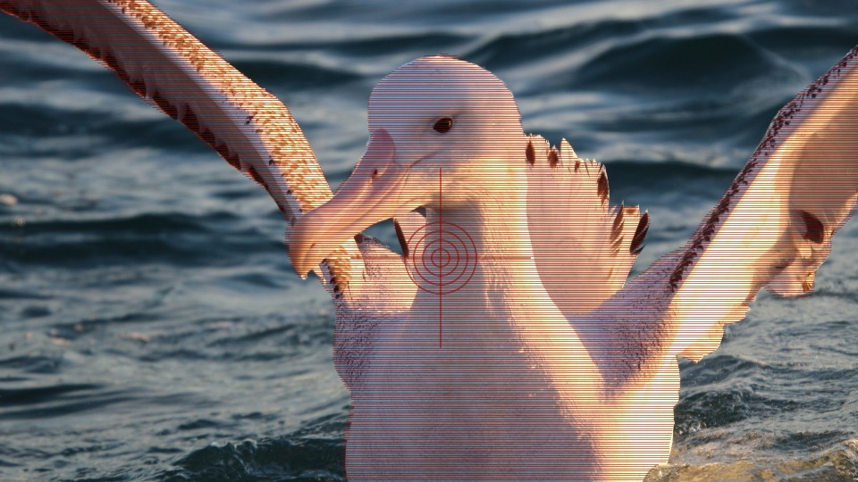
 10. Messing around with my own target and different colours

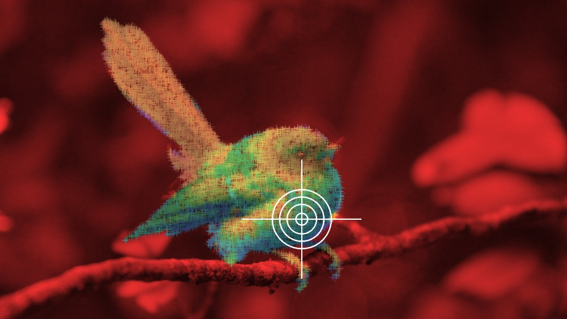
 11. Decided to make the target white to stand out against the red background

### AI mask outcomes
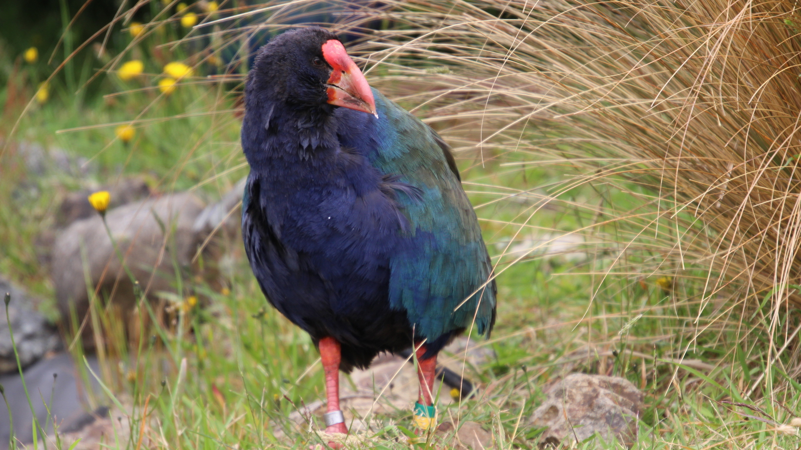

update meta stuff